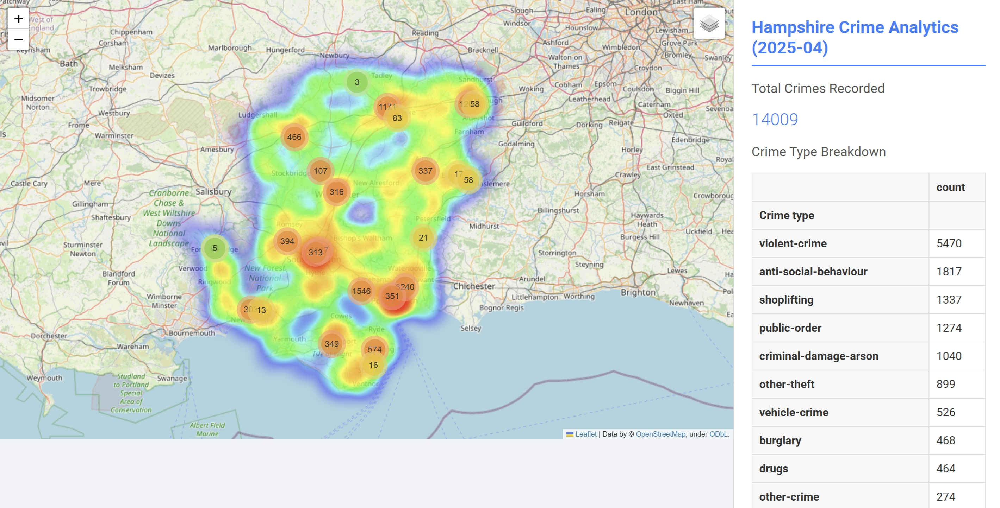

# UK Crime Data Analysis and Visualization

This project provides a set of Python scripts to fetch, analyze, and visualize crime data from the police.uk API. It includes tools to generate interactive maps, heatmaps, and dashboards for crime data in the UK.

## Features

*   **Interactive Crime Maps**: Generate HTML maps with markers for individual crime and stop-and-search incidents.
*   **UK-Wide Heatmap**: Create a heatmap to visualize crime density across the entire UK.
*   **Hampshire Crime Dashboard**: A detailed, interactive dashboard for Hampshire, including analytics, charts, and a map.
*   **Data Caching**: Scripts cache data locally to avoid repeated API calls.
*   **KML Boundary Support**: Use KML files to define geographical boundaries for data fetching.

## Screenshots

Below is a screenshot of the Crime Dashboard for Hampshire:



## Scripts

*   `create_crime_map.py`: Creates an interactive crime map for Hampshire.
*   `create_crime_map_UK.py`: Creates a clustered crime map for the entire UK.
*   `create_heatmap.py`: Generates a UK-wide crime heatmap from cached data.
*   `hampshire_crime_dashboard.py`: Generates an interactive HTML dashboard for Hampshire.
*   `crime_dashboard.py`: A simple script for a basic crime breakdown in a specific area.
*   `get_polygon_from_kml.py`: A utility to extract coordinates from KML files.

## How to Use

1.  **Prerequisites**:
    *   Python 3
    *   `pandas`
    *   `folium`
    *   `requests`
    *   `matplotlib`

2.  **Installation**:
    ```bash
    pip install pandas folium requests matplotlib
    ```

3.  **Directory Structure**:
    *   `boundaries/`: Store your KML files in this directory. The scripts expect a subdirectory for each police force (e.g., `boundaries/hampshire/`).
    *   `cached_data/`: This directory is created automatically to store cached API responses.
    *   `csv_data/`: This directory is for storing CSV files.

4.  **Running the Scripts**:
    *   To generate the Hampshire crime map:
        ```bash
        python create_crime_map.py
        ```
    *   To generate the UK-wide crime map:
        ```bash
        python create_crime_map_UK.py
        ```
    *   To generate the UK crime heatmap:
        ```bash
        python create_heatmap.py
        ```
    *   To generate the Hampshire crime dashboard:
        ```bash
        python hampshire_crime_dashboard.py
        ```

## Data Source

This project uses data from the [police.uk API](https://data.police.uk/docs/).

## License

This project is licensed under the MIT License - see the [LICENSE](LICENSE) file for details.
