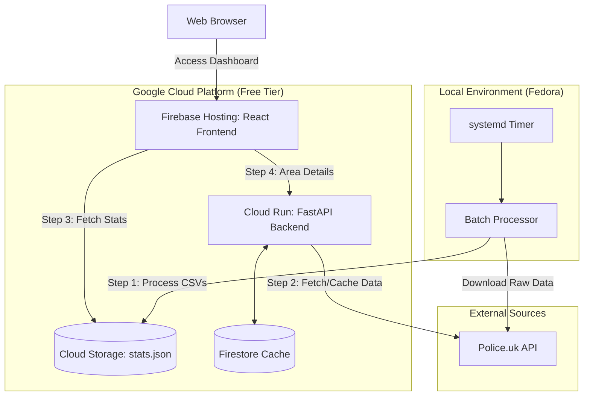

# UK Crime Data Dashboard

An interactive, high-performance dashboard for visualizing and analyzing UK police crime data. This project leverages a modern hybrid-cloud architecture to provide deep insights into crime trends while maintaining a "Zero-to-Low Cost" operating model.

## 🏛️ System Architecture

The application is built on a hybrid model that offloads heavy data processing to local hardware while using serverless cloud components for low-latency delivery.


```mermaid
flowchart TD
    subgraph LocalEnv ["Local Environment (Fedora)"]
        BP[Batch Processor]
        ST[systemd Timer]
        ST --> BP
    end

    subgraph External ["External Sources"]
        PAPI["Police.uk API"]
    end

    subgraph GCP ["Google Cloud Platform (Free Tier)"]
        GCS[(Cloud Storage: stats.json)]
        CR["Cloud Run: FastAPI Backend"]
        FS[(Firestore Cache)]
        FH["Firebase Hosting: React Frontend"]
    end

    BP -- "Step 1: Process CSVs" --> GCS
    BP -- "Download Raw Data" --> PAPI
    
    CR -- "Step 2: Fetch/Cache Data" --> PAPI
    CR <--> FS

    FH -- "Step 3: Fetch Stats" --> GCS
    FH -- "Step 4: Area Details" --> CR
    
    User["Web Browser"] -- "Access Dashboard" --> FH
```

### Design Principles
- **Zero-to-Low Cost:** Optimized to stay within the Google Cloud Platform (GCP) "Always Free" tier.
- **Compute Offloading:** Heavy monthly data processing (gigabytes of CSVs) is done locally to avoid cloud compute costs.
- **Serverless Scaling:** The backend (Cloud Run) and frontend (Firebase) scale to zero when not in use.
- **Hybrid Caching:** High-frequency API requests are cached in Firestore with a TTL index.

---

## 📂 Project Structure

- **`backend/`**: FastAPI server providing geographical crime data. Features a flexible caching layer (SQLite for local, Firestore for production).
- **`frontend/`**: Modern React application built with Vite, TypeScript, and Tailwind CSS. Uses Leaflet for interactive maps and Recharts for analytics.
- **`implementation_plans/`**: Detailed design documents and roadmaps.
- **`GCP_DEPLOYMENT_GUIDE.md`**: Technical documentation for cloud setup and management.

---

## 🛠️ Installation & Local Development

### 1. Prerequisites
- **Python 3.11+**: Managed via [`uv`](https://github.com/astral-sh/uv) (recommended).
- **Node.js 20+**: Managed via `npm`.
- **GCP Account**: Required for Firestore and Cloud Run features.

### 2. Backend Setup (Local)
The backend uses `uv` for lightning-fast dependency management.

```bash
cd backend
uv venv
source .venv/bin/activate.fish  # or your shell equivalent
uv sync
uv run uvicorn main:app --reload
```
*The local backend defaults to using `sqlite_cache.py` for API responses.*

### 3. Frontend Setup
```bash
cd frontend
npm install
npm run dev
```
Open `http://localhost:5173` to view the dashboard.

---

## 🚀 Deployment

The project is configured for one-command deployments once GCP is initialized.

### Frontend (Firebase)
```bash
cd frontend
npm run build
firebase deploy --only hosting
```

### Backend (Cloud Run)
```bash
cd backend
gcloud run deploy crime-dashboard-backend --source . --region europe-west2
```

---

## 🤖 Automation (Local Batch Processing)

The dashboard relies on a monthly `stats.json` file generated from raw Police.uk data. This is automated on a local Fedora machine using `systemd`.

- **Script:** `backend/batch_processor.py`
- **Timer:** `crime-data-batch.timer` (runs on the 28th of every month).
- **Output:** Uploads to GCS bucket `crime-dashboard-stats-data-sdm-1`.

**Monitor automation:**
```bash
systemctl --user status crime-data-batch.timer
journalctl --user -u crime-data-batch.service -f
```

---

## 💡 Useful Commands

| Action | Command |
| :--- | :--- |
| **Start Backend** | `uv run uvicorn main:app` |
| **Start Frontend** | `npm run dev` |
| **Deploy All** | `firebase deploy && gcloud run deploy ...` |
| **Check Logs** | `gcloud run services logs tail crime-dashboard-backend` |
| **Artifact Cleanup** | See `GCP_DEPLOYMENT_GUIDE.md` section 5 |

---

## 📄 License

This project is licensed under the MIT License - see the [LICENSE](LICENSE) file for details.
